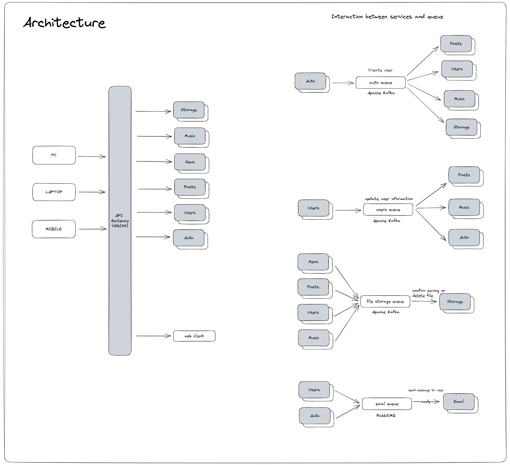

# Dopamine Backend

### Architecture

- [Gateway](gateway/README.md)
- [Auth Service](microservices/auth-service/README.md)
- [Users Service](microservices/users-service/README.md)
- [Posts Service](microservices/posts-service/README.md)
- [Storage Service](microservices/storage-service/README.md)
- [Email Service](microservices/email-service/README.md)

### Schema

### Tech Stack

- NodeJS (NestJS)
- TypeScript
- PostgreSQL
- MongoDB
- Minio
- RabbitMQ
- Kafka
- Docker
