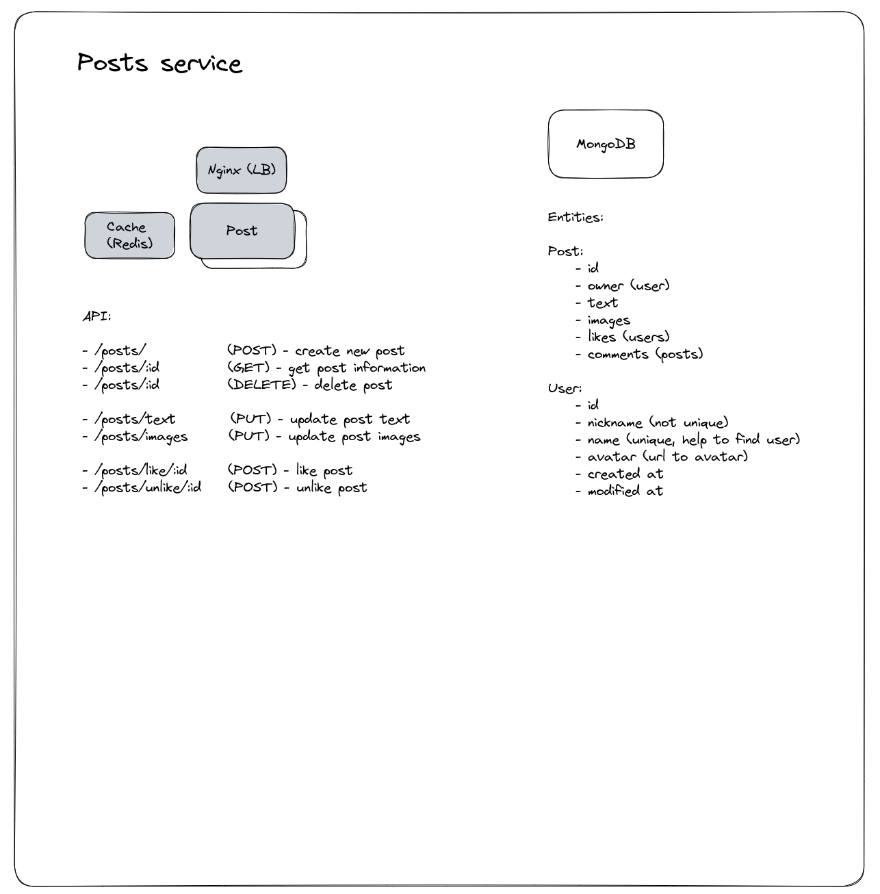

# Dopamine Posts Service

[<-- Back](../../README.md)

### Tasks

-   Creating new posts
-   Removing posts
-   Updating posts
-   Getting post information
-   Commenting Posts
-   Likes posts

### Uses

-   MongoDB (storing post and user information)

### API

