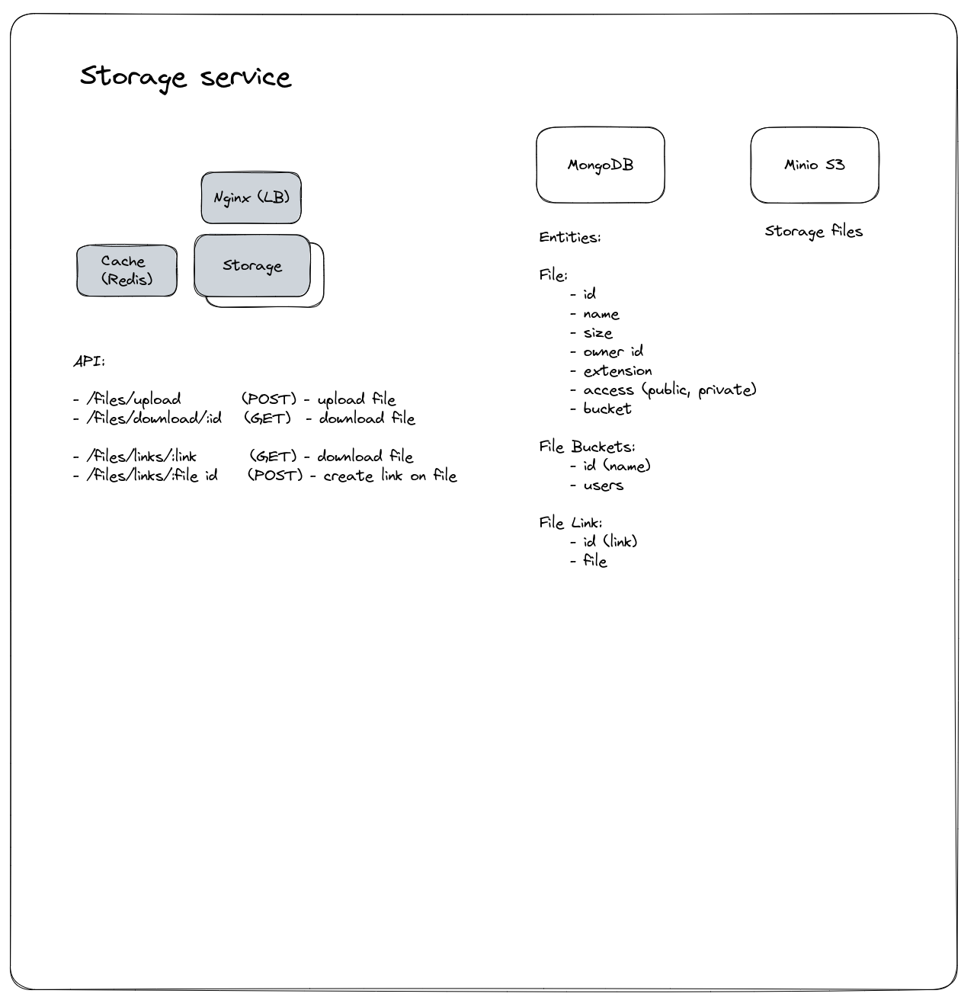

# Dopamine Storage Service

[<-- Back](../../README.md)

### Tasks

-   Uploading files
-   Downloading files
-   Creating links on file
-   Downloading file by link

### Uses

-   MongoDB (storing files information)
-   Minio S3 (storing files)

### API

