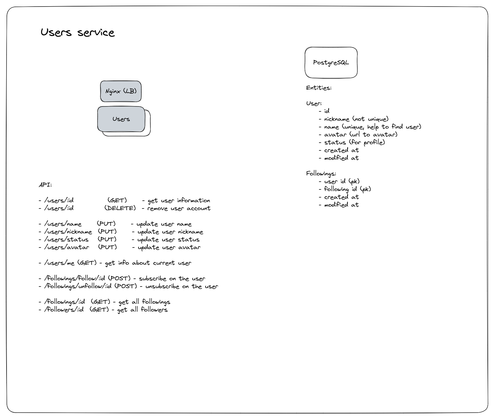

# Dopamine Users Service

[<-- Back](../../README.md)

### Tasks

-   Getting user information
-   Updating user information
-   Getting followings and followers information
-   Follow and unfollow on user

### Uses

-   PostgreSQL (storing user information)

### API

